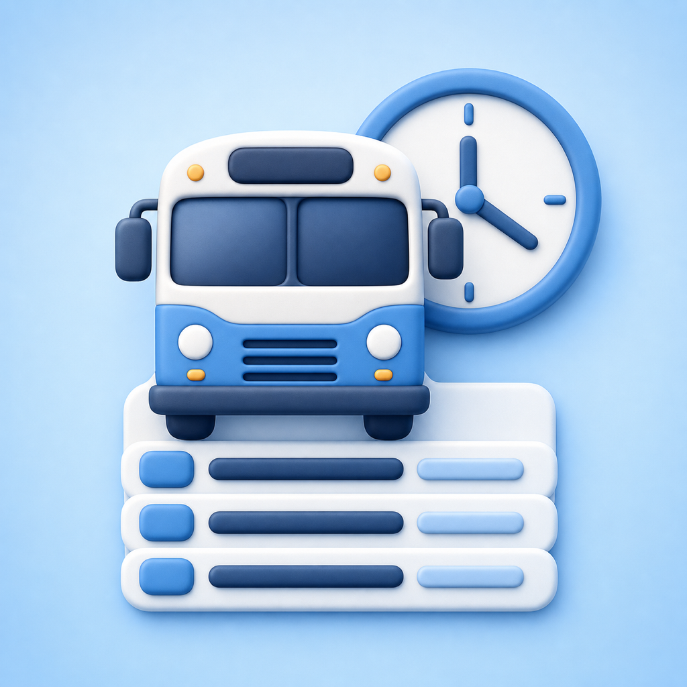

# BusTimeApp

<p align="center">
  
</p>

コロンブスシティ、海浜幕張駅、ヨーカドー前を結ぶバスについて、「次に乗れる便」を最短の操作で確認するためのiPhoneアプリです。

時刻表を並べるだけではなく、現在地、時間帯、前回の行き先、当日の残り便、土日祝、午前4時の運行日境界まで考慮して、今見るべき経路と便を提示します。通知、Live Activity、ウィジェット、Siri／ショートカットにも同じ時刻表と経路判断を共有しています。

> このアプリの案内は登録済みの予定時刻を基準にしています。遅延・臨時運休は自動反映されません。実際の運行は現地の案内を優先してください。

## 対応環境

- iPhone専用
- iOS 16.2以降
- SwiftUI
- アプリ本体、単体テスト、UIテスト、Widget Extensionの4ターゲット
- 外部パッケージ依存なし

ホーム画面ウィジェットとLive Activityを同梱しています。ウィジェット拡張自体のDeployment TargetはiOS 16.1です。

## 対応する停留所と経路

停留所名は現地の案内との一致を優先し、表示言語にかかわらず日本語表記を維持します。

| 出発地 | 目的地 | 経路上の扱い |
| --- | --- | --- |
| コロンブスシティ | 海浜幕張駅 | 直行便と買い物便 |
| 海浜幕張駅 | コロンブスシティ | 直行便とヨーカドー前経由便 |
| コロンブスシティ | ヨーカドー前 | 海浜幕張駅経由 |
| 海浜幕張駅 | ヨーカドー前 | 買い物便 |
| ヨーカドー前 | コロンブスシティ | 買い物便 |

便のモデルは始点と終点だけに限定せず、任意個の途中停留所と各停留所の時刻を持てるようにしています。そのため、経由地、停車順、出発・到着時刻を画面、通知、ウィジェットで同じデータから表現できます。

## このアプリで特にこだわったこと

### 1. 開いた瞬間に、いま必要な便が分かる

- ホームでは「次のバス」の残り時間を最も大きく表示し、その下に出発・到着時刻と次の便をまとめています。
- 経路、運行日、出発／到着検索、時刻のどれを変更しても結果を即時更新します。検索実行ボタンはありません。
- 検索結果は判断しやすい2便に絞り、出発検索では次便から順に、到着検索では指定時刻までに着く便を新しい順に表示します。
- 出発時刻を過ぎた便、1分未満の便、時間と分をまたぐ残り時間を分けて表現します。カウントダウンは分単位で更新します。
- アプリがバックグラウンドにいる間は時計、カウントダウン、天気の定期処理を止め、復帰時に必要な情報だけ更新します。
- 復帰時、過去になった検索時刻は現在時刻へ戻しますが、利用者が指定した未来時刻は保持します。
- 選択中のタブ、運行日、検索種別、検索時刻、前回の行き先を保存し、次回起動時も文脈を引き継ぎます。
- 初回起動では、必要な便の見方、ルートと時刻の選び方、通知／Live Activityを3ページで案内します。最後まで完了したときだけ既読にし、ホームからいつでも見直せます。

### 2. 現在地・時間帯・利用者の選択を競合させない経路判断

- 位置情報が利用できる場合は、3停留所のうち1.5 km以内で最も近い停留所を出発地候補にします。
- 120秒より古い位置情報や、水平精度が500 mを超える情報は採用しません。
- 現在地がない場合は、正午より前を自宅から出る時間帯、正午以降を帰宅する時間帯として経路を提案します。
- 前回の「経路」ではなく、駅かヨーカドー前かという「相手側の停留所」を記憶します。朝夕で向きが逆になっても、行き先の好みを保てます。
- ヨーカドー前行きの最終便後など、候補経路に残り便がなければ、次に利用できる経路へ切り替えます。
- 利用者が手動で選んだ経路は、後から届いた位置情報で勝手に上書きしません。「現在地から選び直す」を明示的に押したときだけ自動判断へ戻します。
- 出発地と目的地を個別のメニューで選べるほか、逆方向の経路が存在するときはワンタップで入れ替えられます。
- 土日祝や全便終了後でも停留所の選択肢自体は隠しません。別の平日の時刻表を調べる操作を妨げないためです。
- なぜその経路になったのかを、現在地・時間帯・手動選択のアイコンと説明で表示します。

### 3. 深夜便と運休日を正しく扱う「午前4時区切り」

- 0:00〜3:59の便は、カレンダー上の当日ではなく前日の運行日に属するものとして扱います。
- 土日と内閣府公表の国民の祝日・休日を運休日として判定します。判定は端末のタイムゾーンに左右されない日本時間固定です。
- 当日の最終便後は空表示で終わらせず、次の実運行日の始発へ繰り越します。
- 週末や祝日をまたぐ検索、通知、ウィジェットも、次に実際に走る平日まで最大14日探索します。
- 深夜に直前の運行日が運休だった場合は、午前4時以降の当日始発から探します。
- 「今日」と「他の平日」を切り替えられます。他の平日では予定時刻を確認できる一方、カウントダウン、通知、Live Activityなど当日性のある機能を明確に無効化します。
- 運休日でも時刻表そのものは隠さず、運休の案内と平日ダイヤを同時に確認できます。
- 祝日データは2027年12月31日まで確認済みで、残り有効期間が90日以下になるとテストが失敗する仕組みです。

### 4. 一覧性と操作性を両立した時刻表

- 午前4時を一日の先頭として時間帯ごとにまとめ、0〜3時台の深夜便は末尾へ並べます。
- 通常の文字サイズでは1行6列、アクセシビリティ文字サイズでは1行4列へ自動変更します。
- 各時刻セルは最低44 ptのタップ領域を確保し、通知設定画面へ直接つながります。
- 現在時刻の時間帯、通知済みの便、おすすめ便、出発済みの便、注記のある便を区別します。
- 「カラー以外で区別」を有効にすると、通知済みはベル、おすすめは破線枠として示し、凡例も形状を説明する文言へ変わります。
- VoiceOverには、出発・到着・経由情報・通知状態・出発済みかどうかをまとめた読み上げラベルを渡します。
- 出発済みの便も消さずに残します。次の運行日に対する通知候補として時刻表全体を参照できるためです。
- 運行中で通知がまだ1件もない場合にだけ、時刻セルから通知を設定できることを案内します。

### 5. 通知とLive Activityを同じ便から管理

- 各便の5分前、10分前、15分前から通知時刻を選べます。
- 同じ便には通知を1件だけ持ち、再設定時は既存設定を置き換えます。便ごとに安定した一意な通知IDを使います。
- 通知許可が未確認なら設定時に要求し、拒否済みならiOSの設定画面への導線を出します。
- 過去になる通知、運行日を決められない便、登録失敗を別々のエラーとして扱います。
- 通知一覧では個別削除と全件削除ができ、期限切れの保存データは起動時に整理します。
- 通知の保存形式にはバージョンを持たせ、旧形式からの移行を実装しています。壊れた保存データを無理に上書きしません。
- Live Activityはロック画面とDynamic Islandの展開・コンパクト・最小表示に対応し、経路、出発／到着、残り時間、出発済み状態を表示します。
- 残り時間は秒を出さず分単位に統一し、値が変わったときだけActivityを更新して過剰な更新を避けます。
- 実行中のLive Activityは再起動後に復元できます。別便が表示中、機能が許可されていない、すでに出発済みなどの失敗理由も案内します。
- 対応端末ではLive Activityを初期状態で有効にし、設定画面のToggleでいつでも変更・保存できます。
- 通常通知を残したままLive Activityを開始でき、通知が未設定なら5分前通知と一緒に開始できます。

### 6. アプリを開かなくても使えるウィジェットとSiri

- ホーム画面のSmall／Mediumと、ロック画面のAccessory Rectangularウィジェットに対応します。
- 次の便とその次の便、経路、残り時間、現在地から選んだかどうかを表示します。
- WidgetKitの再読み込みが遅れても表示が古くなりにくいよう、先の6便を取得し、最大120分先まで1分ごとのTimelineを事前生成します。出発時には次便が自動で繰り上がります。
- ウィジェットは許可済みの場合だけ位置情報を1回取得し、キャッシュがあれば待たずに利用します。手動経路がある場合は位置情報より優先します。
- アプリとウィジェットはApp Groupで前回の行き先と手動経路を共有します。共有領域が利用できない場合もアプリ単体は標準の保存領域へフォールバックします。
- ウィジェットをタップすると独自URLで表示中の経路を渡し、アプリのホームを同じ経路で開きます。URLには日本語ではなく安定した停留所IDを使います。
- App Intent「次のバス」を日本語・英語の呼びかけで登録しています。アプリを開かず、経路、出発、到着、残り時間を1文で返します。

### 7. 時刻・季節・実際の天気で変わるピクセルアート

背景は画像の差し替えではなく、SwiftUIの`Canvas`で4 pt単位のピクセルアートとして描画しています。

- 0時、明け方、朝、昼、夕方、夜のキーフレーム間を連続補間し、空・水面・地面・カード・文字・アクセントを同じ時刻から生成します。
- 春夏秋冬の色味と日照時間を反映し、夏は日が長く、冬は短くなるよう太陽・月の軌道を調整します。
- 空と海は色数を量子化し、ベイヤーディザと決定的な疑似乱数で、毎フレームちらつかないピクセル表現にしています。
- 太陽と月は時刻に沿って移動します。月は朔望月から月齢と照らされる面を計算し、新月・満月の実日付に対するテストもあります。
- 星の瞬き、流れ星、雲、遠景の街と夜景、海を進む船を重ねています。
- 海にはうねり、白波、岸の泡、太陽・月の反射を描き、約12.4時間周期の潮位で水際を動かします。
- 前景には道路の外側線、かすれた中央線、ひびや摩耗、電柱、たるみのある電線、街灯、バス停標識とコンクリート基礎を描いています。
- 街灯は夕方から明け方だけ点灯し、雨天では濡れた道路への光と反射を強めます。
- Open-Meteoから海浜幕張駅付近の現在天気を取得し、雲量、風、雨、雪、霧、雷を別々の状態として背景へ反映します。天気取得に端末の現在地は送りません。
- 風で雲・降水・白波の見え方を変え、雨量は3段階、雪は降り方と積雪、雷は稲光、霧は帯状の層として表現します。
- 天気は1分ごとに更新要否を確認し、実通信は15分間隔に抑えます。失敗時は1、2、4、8、15分と待ち時間を伸ばす指数バックオフを使います。
- 取得済み天気はバージョン付きでキャッシュし、通信失敗時も最後の空模様を維持します。未来時刻を持つ不正なキャッシュは破棄します。
- 空の配色は1分ごとに時刻へ追従し、昼夜が切り替わる際は短いアニメーションでなじませます。
- 「視差効果を減らす」が有効な場合は背景と降水を静止画として描きます。非アクティブ時も更新を止めます。
- アプリアイコンも同じ世界観で、正面向きのバス、道路、バス停、空をピクセルアートにまとめています。

### 8. 背景に埋もれない配色と、利用者が調整できる見た目

- 配色は自動、システム、ライト、ダークから選択できます。自動では背景の昼夜に合わせてColor Schemeを切り替えます。
- 設定画面では朝・昼・夕方・夜の背景を小さく並べ、天気の最終更新時刻やキャッシュ表示中かどうかも確認できます。
- カードの透け具合を0〜100%で調整して保存できます。時刻表のような情報密度の高いカードは自動的に少し濃くします。
- 「透明度を下げる」が有効なら設定値に関係なくカードを不透明にし、背景との混色を防ぎます。
- 夕暮れの途中で文字色だけが灰色へ溶けないよう、文字とカード面を同じしきい値で一括切り替えします。
- 背景との相対輝度からアクセント上の文字色を白／黒で選びます。1日24時間×四季について、本文、アクセント、警告・成功色のコントラストを単体テストしています。
- 未選択のチップにも背景を持たせ、景色の明暗に左右されにくくしています。
- iOS 26以降ではシステムのLiquid Glassに沿うタブを使い、それ以前では同じ世界観のカプセル型タブバーを表示します。
- 画面の本文幅は最大520 ptに抑え、大きいiPhoneでも視線移動が広がりすぎないようにしています。
- ハプティクスはタップ、成功、失敗という明示的な操作結果だけに使い、自動更新では鳴らしません。

### 9. Dynamic Typeと支援機能を後付けにしない

- フォントは`ScaledMetric`を基に拡大し、太字テキスト設定も独自フォント指定へ反映します。
- アクセシビリティ文字サイズでは、経路、時刻、ボタン群を横並びから縦並びへ切り替えます。瞬間的な画面幅ではなく文字サイズを基準にするため、レイアウトが不安定になりません。
- 文字サイズに合わせてタップ領域も拡大し、標準時でも最低44 ptを確保します。
- 主要ボタン、タブ、経路選択、時刻セルにVoiceOverのラベルとヒントを付け、装飾アイコンや区切り線は読み上げから除外します。
- 背景はVoiceOverの要素にせず、色反転の対象からも外して、情報と装飾の責務を分けています。
- セクション見出しには見出しTraitsを付け、画面内を見出し単位で移動できます。
- 「ボタンの形」を有効にすると境界線を強め、「カラー以外で区別」では通知・おすすめ状態を形でも示します。
- 「視差効果を減らす」では背景、タブ切り替え、押下時スケールなどの不要な動きを止めます。
- UIテストでは最大文字サイズで主要操作と時刻セルが押せること、アクセシビリティ監査、RTLでも主要操作が保たれることを確認します。

### 10. 日本語・英語・簡体字中国語を一つの原本から生成

- 画面、通知、ウィジェット、Siriの文言を日本語・英語・簡体字中国語で用意しています。
- 文言は`Scripts/localization_strings.py`を唯一の原本とし、String Catalogと型付きの`L10n.swift`を生成します。
- 単数・複数や複数引数を含む文言を、言語に合った形式で生成できます。
- CIで生成物と原本の差分を検出し、翻訳追加後の生成忘れを防ぎます。
- UIテストは3言語で主要画面を起動し、タブと経路選択が操作できることを確認します。
- 開発言語、運行判定、24時間表記は別の責務として扱います。表示言語や端末地域を変えても、日本のバス時刻がずれません。

### 11. 失敗しても主目的を妨げない設計

- ホーム画面とアプリ全体の画面遷移に有限状態機械を使い、空、検索中、結果あり、運休、エラーや各Sheetの状態を一元管理します。
- 天気が取れない場合は時刻表を止めず、最後の天気または晴れの背景で動作を継続します。
- 位置情報が拒否・不正確・古い場合は時間帯判断へフォールバックし、必要なときだけ設定画面への導線を出します。
- App Groupが使えない場合、通知保存が旧形式の場合、Live Activityが使えない場合にも、それぞれ縮退動作を用意しています。
- OSLogを位置情報、通知、永続化、性能、天気のカテゴリへ分けています。
- MetricKitのクラッシュ、ハング、性能情報は外部サービスへ転送せず、受信件数だけを統合ログへ記録します。
- Debugビルドでは現在時刻、天気、背景アニメーション、保存状態を起動引数で固定でき、時刻・天候依存の画面を再現可能にしています。

### 12. プライバシーを機能の境界として明示

- Privacy Manifestではトラッキングなし、収集データなしを宣言しています。
- Required Reason APIは、アプリ設定とApp Group共有に使うUserDefaultsだけを宣言しています。
- 端末の位置情報は最寄り停留所と経路の選択に使います。天気APIには海浜幕張駅の固定座標を指定し、利用者の現在地を送りません。
- ウィジェットはアプリ側で位置情報が許可されている場合に限り現在地を要求し、自ら許可ダイアログを出しません。
- 天気通信はAPIキー不要のOpen-Meteoへ、現在の天気コード、降水量、雲量、風速だけを問い合わせます。
- アプリとウィジェットは同一のApp Groupだけで設定を共有します。

## 画面と情報の流れ

```text
現在地 ─┐
時間帯 ─┼─> 経路選択 ─> 運行日・出発/到着・時刻 ─> 次の2便
手動選択 ┘       │                                  │
                  └─ App Group ─> Widget / Siri      ├─ 通知
                                                     └─ Live Activity

日本時間・土日祝・午前4時境界 ────────────────────────┘
Open-Meteo ─> 天気キャッシュ ─> 時刻・季節連動のピクセル背景
```

## アーキテクチャ

| 領域 | 主な役割 |
| --- | --- |
| `ContentView` / `AppCoordinator` | アプリ全体の状態、ライフサイクル、Sheet、Alert、タブ、Deep Link |
| `BusTimetableViewModel` | 経路判断、検索条件、運行判定、カウントダウン、位置情報、Live Activity |
| `DataModels.swift` | 任意個の停留所を持てる便と停留所時刻のモデル |
| `Shared/BusSchedule.swift` | アプリ・ウィジェット・Siriで共有する停留所、経路、時刻表、次便検索 |
| `Shared/ServiceCalendar.swift` | 日本時間、土日祝、祝日データ有効期限 |
| `Shared/AppDate.swift` / `SharedAppData.swift` | 再現可能な現在時刻、App Group設定、ウィジェットDeep Link |
| `Shared/AppDiagnostics.swift` / `AppLogger.swift` | MetricKitとカテゴリ別の統合ログ |
| `Features/Home` | 次便を中心にしたホーム、経路・時刻選択、結果表示 |
| `Features/Timetable` | 午前4時区切りの全時刻表、便ごとの通知導線 |
| `Features/Notifications` | 通知時刻計算、権限、登録、保存、一覧管理 |
| `Features/Weather` | Open-Meteo、WMOコード解釈、キャッシュ、再試行、定期更新 |
| `Features/Settings` / `Tutorial` | 表示・カード・Live Activity設定と初回ガイド |
| `DesignSystem` | 時刻・季節配色、ピクセル背景、カード、ボタン、Dynamic Type、ハプティクス |
| `BusTimeWidgetExtension` | ホーム／ロック画面ウィジェット、Live Activity、Dynamic Island |
| `Features/Shortcuts` | App IntentとSiri向けの次便回答 |
| `Localization` / `Scripts` | 3言語のString Catalogと型付きAPIの生成 |

UIへ状態を公開するサービスの多くは`@MainActor`へ寄せ、天気取得はプロトコル、時刻はProvider、保存先は`UserDefaults`注入にして、通信・時計・保存状態をテストから差し替えられるようにしています。SwiftのStrict Concurrency Checkingは`targeted`、コンパイラ警告はエラーとして扱います。

## エンジニア面接で説明したい技術設計

このプロジェクトで技術的に重視したのは、機能数を増やすことよりも、「時刻・場所・運行日が変わっても、利用者へ誤解を与える状態を出さないこと」です。以下は、面接で実装を見せながら説明できるよう、課題、設計判断、実装、トレードオフ、検証を分けて整理したものです。

| テーマ | 解決したかった問題 | 主な設計判断 |
| --- | --- | --- |
| 運行日時 | 深夜便を暦日で扱うと運行日がずれる | 午前4時を境界とする運行日モデルを独立させる |
| 経路推薦 | 非同期の位置情報が手動選択を上書きする | 手動・現在地・時間帯の優先順位を状態として保持する |
| データ共有 | アプリとウィジェットで次便が食い違う | 時刻表と検索をUIから分離し、同じドメイン層を共有する |
| ライフサイクル | 長時間起動や復帰後に情報が古くなる | 定期処理を用途別に管理し、非アクティブ時は停止する |
| ネットワーク | 天気API障害が主機能まで止める | キャッシュ、指数バックオフ、縮退表示を組み合わせる |
| WidgetKit | システム任せの更新では残り時間が古くなる | 将来のTimelineを分単位で先に生成する |
| 描画 | 動く背景と読みやすさ・性能を両立したい | Canvasを静的層と動的層に分け、色ごとにPathをまとめる |
| アクセシビリティ | 背景が時間で変わるため目視確認だけでは漏れる | コントラストを計算し、24時間×四季を自動テストする |
| 多言語 | 画面・通知・Widgetで文言管理が分散する | 対訳表からString Catalogと型付きAPIを生成する |
| 品質保証 | 時刻依存UIはテスト実行時刻で結果が変わる | 時計、通信、保存状態、アニメーションを注入・固定する |

### 1. 暦日ではなく「運行日」をドメインとして扱う

主なコード: [`BusTimetableViewModel.swift`](BusTimeApp/BusTimetableViewModel.swift)、[`NotificationModels.swift`](BusTimeApp/Features/Notifications/NotificationModels.swift)、[`ServiceCalendar.swift`](BusTimeApp/Shared/ServiceCalendar.swift)

#### 課題

終便が0時を越える交通アプリでは、`Calendar`上の日付と運行上の一日が一致しません。例えば土曜日0:13の便は、暦上は土曜日でも、ダイヤ上は金曜日の最終便です。単純に「今日の日付＋0:13」で扱うと、休日判定、次便検索、通知、Live Activityのすべてで別の日を指す可能性があります。

#### 設計と実装

- 運行日の境界を`BusNotificationTimeCalculator.serviceDayBoundaryHour = 4`へ集約しています。
- 日付を持たない時刻表検索では、0:00〜3:59を24:00〜27:59相当へずらす`shiftTime(_:)`を使います。これにより、文字列の`0:13`を`23:47`より後へ自然に並べられます。
- 実際の通知日時では、検索用の整数ではなく日本時間の`Calendar`から運行日開始日を作り、深夜便だけ翌暦日に載せます。
- 「現在の運行日に属する出発日時」と「次に実際に走る出発日時」を別APIにしています。前者は出発済み判定、後者は次の運行日への繰り越しに使います。
- 休日判定は`Asia/Tokyo`固定です。端末が海外にあっても、日本の土日祝と便の所属日が変わりません。
- 次の運行日は最大14日探索し、週末、祝日、振替休日をまとめて飛ばします。

この分離が重要なのは、出発済みの便を安易に翌日の便として扱わないためです。ホームのカウントダウンでは「その運行日の便」を使い、当日の全便が終わって次の運行日を案内するときだけ「次に実際に走る日時」へ切り替えています。

#### トレードオフ

時刻表は現地掲示と比較しやすい`HH:mm`文字列で保持しています。そのためデータ入力は読みやすい一方、実行時に時・分への変換が必要です。路線数が大きくなる場合は、初期化時に検証する`ServiceTime`のような値型へ移し、不正な時刻を起動前に検出する設計が次の候補です。

#### 検証

`notificationTimeUsesServiceDayBoundary`、`currentServiceDayKeepsAfterMidnightBusOnTheCorrectDate`、`earlyMorningOfAServiceDayKeepsTheLateNightBuses`、`nextDepartureSkipsTheWeekend`、`nextDepartureSkipsAPublicHoliday`で、境界の前後と休日またぎを個別に固定しています。

### 2. 自動推薦より利用者の意思を優先する

主なコード: [`BusTimetableViewModel.swift`](BusTimeApp/BusTimetableViewModel.swift)、[`BusSchedule.swift`](BusTimeApp/Shared/BusSchedule.swift)

#### 課題

位置情報は画面表示後に非同期で届きます。利用者が先に経路を選んだ直後、遅れて届いた位置情報で選択が戻ると、UIは正しく動いていても操作に対する信頼を失います。また、前回選んだ経路をそのまま復元すると、朝の往路を夕方にも出してしまいます。

#### 設計と実装

- 経路決定を手動選択、現在地、時間帯の3種類として`RouteDecision`に持たせ、画面にも理由を表示します。
- 手動選択後は`hasManualRouteSelection`でロックし、Core LocationのDelegateから更新が届いても経路を変えません。
- 「現在地に合わせる」を押したときだけ手動状態を解除し、明示的に自動選択へ戻します。
- 位置情報は120秒以内、水平精度500 m以内、停留所から1.5 km以内という3段階の条件を通った場合だけ採用します。
- 現在地が使えない場合、正午までは自宅から出る向き、正午以降は自宅へ戻る向きを選びます。
- 保存するのは経路全体ではなく、駅かヨーカドー前かという相手側の停留所です。方向は現在時刻、行き先の好みは過去の選択から決めます。
- 希望経路の便が終わっていれば、同じ向きで次の出発が最も早い経路、それもなければ全経路で最も早い経路へフォールバックします。
- 運休日や全便終了後は「本日の残り便」で候補を絞りません。リアルタイム推薦の都合で、平日ダイヤを調べる操作まで失わせないためです。

#### トレードオフ

推薦は3停留所に最適化した決定的なルールです。機械学習や経路探索を導入していないため説明可能でテストしやすい一方、路線網が増えた場合は、優先条件を値として評価する`RouteRecommendationPolicy`へ分離する余地があります。

#### 検証

`aManuallyChosenRouteIsNotOverwrittenByLocation`、`askingForTheCurrentLocationClearsTheManualChoice`、`theChosenDestinationIsRememberedButTheDirectionFollowsTheClock`、`currentLocationSelectsTheNextAvailableRouteAfterYokadoServiceEnds`で、非同期更新と利用者操作の競合を確認しています。

### 3. 検索結果とリアルタイム機能を別の概念にする

主なコード: [`BusTimetableViewModel.swift`](BusTimeApp/BusTimetableViewModel.swift)、[`ContentView.swift`](BusTimeApp/ContentView.swift)

#### 課題

運休日でも利用者は次の平日の時刻表を調べたい一方、その便に「あと10分」や通知ボタンを出すと、今日走る便だと誤認させます。「検索できるか」と「今乗るための機能を使えるか」は同じ条件ではありません。

#### 設計と実装

- 検索自体は運休日にも継続し、平日ダイヤを返します。
- `isRealtimeContext = isViewingToday && selectedDayHasService`を、カウントダウン、通知、Live Activityを有効にする共通条件にしています。
- 「他の平日」は実在する次の運行日を代表日として選ぶため、土日祝を飛ばした日付表示ができます。
- 出発検索は指定時刻以降の2便、到着検索は指定時刻までに到着する便を近い順に2便返します。到着検索では2便目が「次」ではなく「1本前」になるため、見出しも切り替えます。
- 当日の候補がなくなった場合だけ、出発検索を次の運行日の先頭へ折り返します。日中の検索結果を不用意に翌日へ混ぜません。
- 検索条件の変更はSwiftUIの`onChange`から即時反映します。小規模な静的ダイヤなので、差分更新より完全再検索の単純さを選んでいます。
- 初期化時に設定復元と初回検索まで済ませ、空の画面を一度描いてから結果を差し込むレイアウトシフトを避けています。

#### トレードオフ

現在の検索は路線ごとに線形走査とソートを行います。現状の便数では読みやすさを優先できますが、大規模ダイヤなら運行日別に前処理した配列と二分探索へ置き換えるのが適切です。

#### 検証

`arrivalSearchListsTheEarlierServiceSecond`、`daytimeSearchDoesNotWrapToTheNextServiceDay`、`lateNightShowsTheMorningServiceInsteadOfNothing`、`lookingAtAnotherWeekdayHidesRealtimeInformation`、`weekendKeepsTheNoticeAndStillShowsWeekdayTimes`で、検索とリアルタイム表示の境界を守っています。

### 4. 時刻表をUIから分離し、すべての入口で共有する

主なコード: [`DataModels.swift`](BusTimeApp/DataModels.swift)、[`BusSchedule.swift`](BusTimeApp/Shared/BusSchedule.swift)、[`SharedAppData.swift`](BusTimeApp/Shared/SharedAppData.swift)、[`NextBusIntent.swift`](BusTimeApp/Features/Shortcuts/NextBusIntent.swift)

#### 課題

アプリ、ウィジェット、Siriが別々に次便を計算すると、同じ時刻に異なる便を案内する可能性があります。Widget Extensionは別プロセスなので、アプリのViewModelを直接共有することもできません。

#### 設計と実装

- `BusStop`、`BusRoute`、`Bus`、`BusStopTime`をUIに依存しないモデルとして定義しています。
- `Bus`は始点・終点だけでなく任意個の停留所を持ち、買い物便の経由地を特別な分岐なしで扱います。
- `BusSchedule`へ全時刻表、最寄り停留所、推薦経路、次便検索を集約し、アプリ、Widget Extension、App Intentから同じ処理を呼びます。
- 便IDは停留所名と各時刻の組み合わせから決定的に作ります。通知ID、画面差分、Live Activity追跡で同じ便を指せます。
- App Groupで共有する状態は、相手側停留所とセッション中の手動経路に絞っています。画面固有の状態を拡張プロセスへ漏らしません。
- ウィジェットのDeep Linkは日本語の経路名ではなく、`mansion-station`のような安定IDを渡し、アプリ側で`BusRoute`へ復元します。

#### トレードオフ

時刻表をバンドル内に持つため、オフラインで必ず動作し、サーバー障害や認証情報がありません。その代わり、ダイヤ変更にはアプリ更新が必要で、遅延や臨時運休は扱いません。この制約は画面、通知本文、READMEで明示しています。

#### 検証

`routeIsResolvedFromOriginAndDestination`、`widgetLinkCarriesTheRouteBothWays`、`widgetLinkIgnoresOtherURLs`、`openingFromTheWidgetSwitchesTheRoute`、`shortcutAnswerNamesTheRouteAndTheNextDeparture`で、プロセスをまたぐ境界を検証しています。

### 5. 画面状態とライフサイクルを明示的に管理する

主なコード: [`AppCoordinator.swift`](BusTimeApp/AppCoordinator.swift)、[`HomeStateMachine.swift`](BusTimeApp/Features/Home/HomeStateMachine.swift)、[`ContentView.swift`](BusTimeApp/ContentView.swift)

#### 課題

複数のSheetやAlertを個別のBoolで管理すると、同時に複数が真になる不正状態が作れます。また、タイマーを起動したままバックグラウンドへ移ると、表示されない画面のために処理を続け、復帰時に古い基準時刻が残ります。

#### 設計と実装

- `AppCoordinator`はダッシュボード、チュートリアル、設定、通知管理、通知結果、Live Activityエラーを排他的な`AppState`として持ちます。
- Viewは状態を直接書き換えず、`AppEvent`を`send(_:)`へ渡します。初回チュートリアルも「閉じた」ではなく「完了した」イベントでだけ既読にします。
- ホームの検索状態は`HomeStateMachine`でidle、searching、ready、empty、serviceUnavailable、failedへ遷移させます。
- `scenePhase`がactiveのとき、時刻、経路可用性、位置情報、Live Activity可用性、天気を再評価します。
- 非アクティブ時には`SkyClock`、ホームの30秒タイマー、天気の1分確認タイマーを停止します。復帰時は同じTimerを重複生成しないよう、各`startTimer()`で既存購読を確認します。
- 検索時刻が過去なら現在へ進めますが、未来なら利用者の意図として保持します。
- 選択タブは`SceneStorage`、検索条件は`UserDefaults`に分け、シーン単位とアプリ全体の永続性を使い分けています。

#### トレードオフ

状態機械により遷移は明確になりますが、画面数がさらに増えると単一Coordinatorのswitchも大きくなります。その段階では機能単位の子Coordinatorへ分割する設計が適しています。

#### 検証

`homeStateMachineTransitions`、`appCoordinatorTransitions`、`tutorialIsOnlyMarkedSeenAfterCompletion`、`appActivationRefreshesPastSearchTimeAndResults`、`homeSearchPreferencesRestoreAcrossLaunches`で状態と復帰動作を確認しています。

### 6. 天気APIを「失敗してもよい付加機能」として隔離する

主なコード: [`WeatherViewModel.swift`](BusTimeApp/Features/Weather/WeatherViewModel.swift)、[`WeatherService.swift`](BusTimeApp/Features/Weather/WeatherService.swift)、[`WeatherModels.swift`](BusTimeApp/Features/Weather/WeatherModels.swift)

#### 課題

天気は背景を豊かにしますが、バス時刻の表示より優先度は低い機能です。通信失敗で画面全体をエラーにしたり、再試行を繰り返して電力と通信量を消費したりすべきではありません。

#### 設計と実装

- 取得処理を`WeatherFetching`プロトコルにし、本番の`OpenMeteoWeatherService`とDebug／テスト用サービスを差し替えます。
- URLは`URLComponents`で組み立て、8秒のtimeout、HTTPステータス、JSON decodeを別々に検査します。
- 海浜幕張駅の固定座標を使い、端末の位置情報と天気通信を分離しています。
- 1分ごとに更新要否を確認し、成功後15分以内は通信しません。
- 失敗時は1、2、4、8、15分へ待ち時間を増やし、API障害中の連続アクセスを避けます。
- `isRefreshing`で同時リクエストを抑止し、UI公開状態は`@MainActor`上で直列に更新します。
- 成功値をversion付きで保存し、再起動直後から前回の空模様を表示します。
- API失敗時は最後の成功値を維持します。キャッシュ時刻が現在より5分を超えて未来なら、時計変更や破損とみなして採用しません。
- 設定画面には成功時刻と、現在はキャッシュを表示しているかを出し、縮退動作を隠しません。
- `-forceWeather`起動引数で通信せずに雨量を固定でき、デザイン確認を再現可能にしています。

#### トレードオフ

地域を固定したことで、個人の現在地に合う天気よりも、対象路線の景色とプライバシーを優先しています。対象地域が増える場合は、路線ごとの固定座標をドメインデータへ持たせる方法が自然です。

#### 検証

`weatherRefreshesOnlyAfterTheInterval`、`weatherKeepsLastValueWhenFetchFails`、`weatherRestoresTheLastSuccessfulValueFromCache`、`weatherRejectsCacheWithAFutureTimestamp`、`weatherFailureUsesExponentialBackoff`で、成功より失敗経路を細かく検証しています。

### 7. WidgetKitの更新タイミングを信用しすぎない

主なコード: [`NextBusWidget.swift`](BusTimeWidgetExtension/NextBusWidget.swift)、[`NextBusWidgetView.swift`](BusTimeWidgetExtension/NextBusWidgetView.swift)、[`BusTimeWidgetLiveActivity.swift`](BusTimeWidgetExtension/BusTimeWidgetLiveActivity.swift)

#### 課題

WidgetKitのTimeline再要求時刻はシステムが最終決定します。現在時刻のEntryを1件だけ返すと、再読み込みが遅れたときに残り時間と「次の便」が古いままになります。

#### 設計と実装

- Timeline作成時に次の6便を取得し、最大120分先まで1分ごとのEntryを先に生成します。
- 各分で出発済みの便を除外し、先頭2件を改めてEntryへ入れます。カウントダウンだけでなく、出発した瞬間の次便繰り上げも事前に表現できます。
- 作成済みEntryの末尾をreload policyに指定し、保持している将来情報を使い切った地点で再要求します。
- ウィジェットは位置情報許可を自ら要求せず、`isAuthorizedForWidgetUpdates`が真の場合だけ1回取得します。キャッシュ済み位置があれば即座に使います。
- 手動経路、現在地、時間帯というアプリと同じ推薦規則を使います。
- Small、Medium、Accessory Rectangularを別レイアウトにし、Smallの主時刻は`ScaledMetric`へ追従させます。
- タップ時は表示中の経路をDeep Linkでアプリへ渡すため、Widgetとアプリの文脈が途切れません。

Live Activity側では、ロック画面とDynamic Islandに同じ`BusActivityAttributes`を使い、表示テキストは`TimelineView(.everyMinute)`で進めます。アプリからのActivity更新は残り分が変わったときだけ送り、秒単位の無意味な更新を避けています。

#### トレードオフ

120分は鮮度とEntry数の上限を両立するための有限な窓です。2時間を超えて再読み込みされない可能性は残るため、最後のEntryで再要求する設計と組み合わせています。

#### 検証

Deep Linkの往復、別URLの拒否、アプリ側の経路切り替え、Live Activityの秒を含まない残り時間を単体テストしています。CIではWidget Extensionをアプリ本体とは別にビルドします。

### 8. ピクセル背景をCanvasで生成しながら描画負荷を抑える

主なコード: [`SkyBackground.swift`](BusTimeApp/DesignSystem/SkyBackground.swift)、[`SkyPalette.swift`](BusTimeApp/DesignSystem/SkyPalette.swift)

#### 課題

時刻、季節、天気へ連続的に反応する背景を画像アセットだけで実現すると、組み合わせが増え続けます。一方、画面全体をピクセル単位で毎フレーム再計算すると、装飾のために描画負荷が増えます。

#### 設計と実装

- 4 ptを1セルとし、6段階へ量子化した空と海をSwiftUI `Canvas`で描きます。
- 走査量の多い空、太陽・月、遠景、地面を`staticLayer`へ分離し、定期アニメーションのtickごとには再計算しません。時刻や天気の状態が変わったときだけSwiftUIの再評価対象になります。
- 雲、海、波、反射、星、船、街灯、バス停、雪、霧を`animatedLayer`へ置き、0.4秒間隔の`TimelineView`で更新します。
- 降水、流れ星は発生周期が異なるため独立したTimelineにし、不要な層まで同じ頻度で描き直しません。
- 空と水面は同じ色が続く横方向のセルを1矩形へまとめ、さらに色ごとに1本の`Path`へ集約します。セルごとの`fill`呼び出しを避けます。
- 星、遠景の灯り、道路の摩耗などはseed付き疑似乱数から決め、再描画しても位置が変わらないようにしています。
- 潮位を基準となる1つの岸線として計算し、海、砂浜、泡、反射が別々の位置へずれないようにしています。
- Paletteは背景だけでなく、カード、文字、状態色、地面、標識まで一括生成します。別々の色体系が夕暮れで衝突することを避けています。
- 「視差効果を減らす」では同じ描画関数へ固定tickを渡します。別の簡易背景へ差し替えず、世界観を保ったまま時間変化だけを止めます。

#### トレードオフ

Canvas生成によりアセット数を抑え、条件の組み合わせを表現できますが、`SkyBackground.swift`は責務が大きいファイルです。描画パス単位の構造体へ分割し、計測可能な境界を作ることが次の改善候補です。

#### 検証

時刻の正規化、太陽・月の画面内位置、日照時間、街灯時間、月相を単体テストしています。UIテストでは`-SkyBackgroundStill`を渡し、永続アニメーションがUI問い合わせの待機条件へ影響しないようにしています。

### 9. アクセシビリティを見た目ではなく不変条件として検証する

主なコード: [`SkyPalette.swift`](BusTimeApp/DesignSystem/SkyPalette.swift)、[`SkyComponents.swift`](BusTimeApp/DesignSystem/SkyComponents.swift)、[`DynamicTypeSupport.swift`](BusTimeApp/DesignSystem/DynamicTypeSupport.swift)、[`TimetableTabView.swift`](BusTimeApp/Features/Timetable/TimetableTabView.swift)

#### 課題

このアプリは背景色が時刻と季節で変わり、カードの透明度も利用者が調整できます。特定の昼画面だけを目視しても、夕暮れや冬の配色で文字が読める保証にはなりません。

#### 設計と実装

- RGBを相対輝度へ変換し、前景と背景のコントラスト比を計算できるようにしています。
- 24時間を15分刻み、四季すべてでPaletteを生成し、本文と補足文字は4.5:1以上、非テキストの警告・成功色は3:1以上を要求します。
- アクセント上の文字は白または黒をコントラスト計算で選びます。
- 夕暮れで文字色を連続補間すると、途中でカードと同じ灰色へ近づきます。そのため本文色とカード面は同じ境界で昼用・夜用を一括切り替えします。
- `ScaledMetric`で文字を拡大し、明示ウェイトのフォントにも「文字を太くする」を1段階のweight変換として反映します。
- 最小44 ptのタップ領域自体も`ScaledMetric`で拡大し、大きくなったアイコンや文字が固定枠からはみ出さないようにしています。
- アクセシビリティ文字サイズでは、`DynamicTypeStack`がHStackからVStackへ構造を切り替えます。
- 「透明度を下げる」ではカードの好み設定より可読性を優先して不透明化します。
- 「ボタンの形」「カラー以外で区別」「視差効果を減らす」を、それぞれ輪郭、形状、アニメーションへ反映します。
- VoiceOverへ意味のまとまりを1ラベルで渡し、装飾背景、区切り線、重複するアイコンを読み上げ対象から除外します。

#### トレードオフ

カード濃度を最小にした状態は、利用者が風景を優先する明示設定です。コントラストテストは標準濃度を基準にし、「透明度を下げる」では必ず不透明にすることで、好みと支援設定の優先順位を分けています。

#### 検証

計算ベースの配色テストに加え、最大文字サイズで主要操作と時刻セルが押せるテスト、主要ラベルの存在確認、Xcode Accessibility Audit、3言語、RTLレイアウトをUIテストしています。コントラストは時刻・季節を総当たりする単体テスト、クリッピングと操作性は実画面のUIテストという役割分担です。

### 10. 翻訳を生成パイプラインとして扱う

主なコード: [`localization_strings.py`](Scripts/localization_strings.py)、[`generate_l10n.py`](Scripts/generate_l10n.py)、[`Localizable.xcstrings`](BusTimeApp/Localization/Localizable.xcstrings)

#### 課題

画面、通知、ウィジェット、Siriへ同じ概念の文言が広がると、キーの打ち間違い、翻訳の欠落、生成物の直接編集が起きやすくなります。特に数値を含む文言は、英語の単数・複数を単純な`String(format:)`だけでは正しく扱えません。

#### 設計と実装

- `Scripts/localization_strings.py`を235件の文言の唯一の原本にしています。
- Pythonスクリプトが日本語・英語・簡体字中国語のString Catalogと、`L10n.Result.nextBus`のような型付きSwift APIを同時生成します。
- キーの重複を生成前に検出します。
- 引数の型からSwift関数を生成し、言語規則が必要な文言はString Catalogのplural variationと`localizedStringWithFormat`を使います。
- `--check`はファイルを書き換えず、原本から得られる内容と生成物を比較します。CIで差があれば失敗させます。
- アプリとWidget Extensionの両方へ同じCatalogと`L10n`を含め、別Bundleでも同じキーを解決できるようにしています。
- 停留所名は現地表示との一致、enumのraw valueは保存互換性という理由で翻訳対象から明示的に除外します。

#### トレードオフ

原本がPythonのタプルなので、翻訳管理サービスとの双方向同期はありません。チームや言語数が増えた場合は、String Catalogを原本とするか、翻訳サービス用のimport／export層を追加する判断が必要です。

#### 検証

生成物チェックに加え、UIテストを`ja_JP`、`en_US`、`zh_CN`で起動し、ホームと時刻表を実際に操作してスクリーンショットをArtifactへ残します。`ar_SA`では翻訳のフォールバックを含むRTL配置の操作性も確認します。

### 11. 永続化データを将来変更できる形にする

主なコード: [`NotificationViewModel.swift`](BusTimeApp/Features/Notifications/NotificationViewModel.swift)、[`WeatherViewModel.swift`](BusTimeApp/Features/Weather/WeatherViewModel.swift)、[`SettingsViewModel.swift`](BusTimeApp/Features/Settings/SettingsViewModel.swift)

#### 課題

ローカル通知の表示一覧は、OSへ登録したリクエストとは別に、アプリ側でも便・経路・通知時刻を保持する必要があります。構造体を配列のまま保存すると、後からフィールドを追加した際に形式を判別できません。

#### 設計と実装

- 通知一覧は`{ version, notifications }`というEnvelopeでJSON保存します。
- 旧版の配列形式を読めた場合はversion 1へ移行します。
- 期限切れ通知だけを除外し、通知日時順へ正規化してから保存します。
- decode不能なデータは空表示にしますが、その場で上書きしません。原因調査や将来の復旧可能性を残します。
- 天気キャッシュもversion 1を持ち、未対応versionと未来時刻を明示的に拒否します。
- カード濃度は保存前に0〜1へclampし、不正値がUIへ入らないようにします。
- App Groupが作れない環境では標準`UserDefaults`へフォールバックし、アプリ単体の起動を優先します。

#### トレードオフ

通知のOS側Pending Requestとアプリ側メタデータの完全な双方向照合までは行っていません。通知が外部要因で消えた場合まで厳密に同期するなら、起動時に`pendingNotificationRequests()`との突合が必要です。

#### 検証

`legacyNotificationStorageMigratesToVersionedEnvelope`、`corruptNotificationStorageIsNotOverwritten`、`cardOpacityDefaultsToStandardAndPersistsChanges`、天気キャッシュの復元・拒否テストで、正常系だけでなく移行と破損を確認しています。

### 12. テストしにくい「現在」を依存として外へ出す

主なコード: [`BusTimeAppTests.swift`](BusTimeAppTests/BusTimeAppTests.swift)、[`BusTimeAppUITests.swift`](BusTimeAppUITests/BusTimeAppUITests.swift)、[`ci.yml`](.github/workflows/ci.yml)

#### 課題

時刻表アプリの結果、空の色、休日判定、通知時刻は実行した瞬間に依存します。テスト内で`Date()`を直接使うと、深夜や日付変更で再現しない失敗が起きます。天気通信、保存済み設定、永続アニメーションもUIテストを不安定にします。

#### 設計と実装

- `HomeViewModel`、`WeatherViewModel`、`SkyClock`へ`nowProvider`を注入します。
- 暦は`Calendar`、保存先は分離した`UserDefaults` suite、天気は`WeatherFetching`として差し替えます。
- UIテストでは`-UITestNow`で時刻、`-forceWeather clear`で天気、`-SkyBackgroundStill`で背景、`-UITestResetState`で保存状態を固定します。
- 単体テストは80件あり、運行日、経路推薦、状態遷移、通知、天気、配色、月相、Widget Deep Link、多言語日付を対象にしています。
- UIテストは8件あり、主要導線、最大文字サイズ、アクセシビリティ監査、3言語、RTL、起動を対象にしています。
- CIはXcode 16.2、16.4、26の複数環境でDebug／Releaseをビルドし、安定版2環境でテストとcoverageを記録します。
- Widget Extensionは別Schemeでビルドし、本体だけ通って拡張が壊れる状態を検出します。
- `SWIFT_TREAT_WARNINGS_AS_ERRORS=YES`をプロジェクトとCIの両方で指定し、ローカル設定差で警告が見逃されないようにしています。
- 静的解析、翻訳生成物、TODO／FIXME、警告件数、失敗ログ、xcresultを別々の証拠として残します。

#### トレードオフ

現在のCIはcoverageを記録しますが、最低coverage率によるGateは設けていません。重要なドメイン境界を振る舞いテストで守ることを先に選んでいます。規模が増えた場合は、対象モジュールを限定したcoverage下限を追加する余地があります。

#### 検証

単体テスト内では固定日時、独立した`UserDefaults`、成功・失敗を制御できるWeather Stubを実際に使っています。UIテストの共通起動処理では毎回同じ時刻・天気・保存状態・静止背景を渡し、その上で言語と文字サイズだけをシナリオごとに変えています。これにより、テスト用の差し替え口そのものが継続的に利用されます。

### 13. プライバシーと観測可能性の境界を決める

主なコード: [`PrivacyInfo.xcprivacy`](BusTimeApp/PrivacyInfo.xcprivacy)、[`AppLogger.swift`](BusTimeApp/Shared/AppLogger.swift)、[`AppDiagnostics.swift`](BusTimeApp/Shared/AppDiagnostics.swift)

#### 課題

障害解析のために情報を増やすほど、位置情報を使うアプリではプライバシー上の責任も増えます。また、Timer、Core Location、通信、ActivityKitから別々に状態更新が届くため、観測可能性だけでなく更新競合の抑止も必要です。

#### 設計と実装

- Privacy Manifestはトラッキングなし、収集データなし、Required Reason APIとしてUserDefaultsの理由だけを宣言します。
- 位置情報は端末内の最寄り停留所選択に使い、Open-Meteoには固定座標だけを送ります。
- ログはlocation、notifications、persistence、performance、weatherへ分類し、障害箇所を絞れるようにしています。
- MetricKitからクラッシュ、ハング、性能payloadを受け取りますが、外部サービスへ転送せず、受信件数だけを統合ログへ残します。
- UI向けObservableObjectの多くを`@MainActor`に置き、非同期処理の完了後も公開状態をMain Actor上で変更します。
- 天気の同時更新は`isRefreshing`、Live Activityの過剰更新は直前の残り分キャッシュ、Timerの重複は購読のnil確認でそれぞれ抑止します。

#### トレードオフ

外部クラッシュ解析を使わないため、利用者端末を横断した集計や即時アラートはありません。個人向けアプリとしてデータ最小化を優先した判断です。またStrict Concurrency Checkingは現在`targeted`であり、Swift 6の`complete`へ進める際は、Core Location Delegateを持つ`HomeViewModel`のActor境界を明示することが主な改善点です。

#### 検証

アプリ本体とWidget Extensionの両方にPrivacy Manifestを置き、トラッキング、収集データ、Required Reason APIを同じ内容で宣言しています。CIではStrict Concurrency `targeted`と警告のエラー化を全ターゲットへ適用してビルドします。Privacy Manifestの意味的な自動検査は現状未導入であり、将来はArchiveからManifestを抽出して期待値と比較するGateが改善候補です。

## 現在認識している技術的トレードオフと次の改善

面接では、実装済みの工夫だけでなく、現在の制約と次に何を変えるかも説明できます。

| 現在の判断 | 得られている利点 | 規模が増えた場合の改善 |
| --- | --- | --- |
| 時刻表をアプリへ同梱 | オフライン動作、サーバー不要、結果が決定的 | 署名付きダイヤ配信、更新日表示、ローカルfallback |
| `HH:mm`文字列で時刻を保持 | 現地時刻表との比較・編集が容易 | 検証付き`ServiceTime`値型と生成時validation |
| 線形検索で2便を抽出 | 小規模データでは単純で読みやすい | 運行日別indexと二分探索 |
| ルールベースの経路推薦 | 説明可能で再現しやすい | Policy型へ分離し、重みと優先順位をテーブル化 |
| `HomeViewModel`に検索・位置・Activityを集約 | 画面状態を一か所で追跡しやすい | SearchEngine、RouteRecommender、LiveActivityControllerへ分割 |
| `SkyBackground`に描画を集約 | レイヤー順と世界観を一望できる | 描画パス単位へ分割し、計測・Snapshot Testを追加 |
| 固定地点の天気 | 対象路線に一致し、現在地を送らない | 路線ごとの固定観測地点をデータ化 |
| OSLogとMetricKitのみ | 外部送信なし、構成が小さい | 同意設計を前提に匿名化した障害集計を検討 |
| Strict Concurrency `targeted` | 現行Frameworkとの互換性を保って段階導入 | Actor境界を整理して`complete`へ移行 |
| coverageは記録のみ | 振る舞い中心で重要境界を先にテスト | モジュール別の下限と差分coverageを導入 |

## 面接での短い説明例

> バス時刻表アプリですが、単なる一覧表示ではなく、午前4時を境界にした運行日モデルを中心に設計しました。これにより、0時台の深夜便、土日祝、次の運行日への繰り越しを、検索・通知・Widgetで同じルールとして共有しています。また、非同期の位置情報が利用者の手動選択を上書きしない優先順位、WidgetKitの更新遅延を前提とした120分先までのTimeline生成、時刻と季節で変わる背景のコントラスト総当たりテストに特にこだわりました。現在時刻、通信、保存先を注入できるようにし、80件の単体テストと8件のUIテスト、複数XcodeのCIで境界条件を再現可能にしています。

深掘りされた場合は、次の順で説明すると、見た目だけではなく設計・実装・品質保証まで一貫して伝えられます。

1. 午前4時境界を整数の運行時刻と実日付へどう変換したか
2. 手動選択・位置情報・時間帯推薦の競合をどう防いだか
3. 同じ`BusSchedule`をアプリ、Widget、Siriでどう共有したか
4. API失敗、バックグラウンド、Widget更新遅延へどう縮退したか
5. 動的な背景をコントラスト計算とUIテストでどう保証したか
6. 現在のトレードオフを、利用規模が増えたときどう分割・移行するか

## 使用しているApple Framework

- SwiftUI / Combine
- Core Location
- User Notifications
- ActivityKit / WidgetKit
- App Intents
- MetricKit / OSLog

## ビルドと実行

### Xcodeから実行

1. `BusTimeApp.xcodeproj`をXcodeで開きます。
2. Schemeに`BusTimeApp`を選びます。
3. 実行先に接続済みiPhone、またはiPhone Simulatorを選びます。
4. `Run`を実行します。

`Any iOS Device (arm64)`や`Generic iOS Device`はArchive／Build専用で、アプリの実行先にはできません。`A build only device cannot be used to run this target`と表示された場合は、実機またはシミュレータへ変更してください。

実機、Archive、TestFlightでは、Signing & Capabilitiesで自分のTeamを選び、アプリ本体とWidget ExtensionのBundle IDおよびApp Group `group.com.hara.BusTimeApp`をDeveloper Account側にも用意する必要があります。

### コマンドラインでビルド

```sh
xcodebuild build \
  -project BusTimeApp.xcodeproj \
  -scheme BusTimeApp \
  -configuration Debug \
  -destination 'generic/platform=iOS Simulator' \
  CODE_SIGNING_ALLOWED=NO
```

### テスト

利用できるSimulator名に合わせて`name`と`OS`を変更してください。

```sh
xcodebuild test \
  -project BusTimeApp.xcodeproj \
  -scheme BusTimeApp \
  -destination 'platform=iOS Simulator,name=iPhone 16,OS=18.5' \
  -testLanguage ja \
  -testRegion JP \
  -enableCodeCoverage YES
```

### TestFlight

1. VersionとBuildを更新します。
2. 実行先に`Any iOS Device (arm64)`を選びます。
3. Xcodeの`Product > Archive`を実行します。
4. Organizerで`Distribute App > App Store Connect > Upload`を選びます。
5. App Store Connectで処理完了後、TestFlightの内部テスターまたは外部テスターへ配布します。

配布用ArchiveではiPad向け設定を持たないiPhone専用アプリとしてビルドされます。

## ローカライズの更新

文言は生成物を直接編集せず、原本を更新します。

```sh
# Scripts/localization_strings.pyを編集した後に生成
python3 Scripts/generate_l10n.py

# 原本と生成物が一致しているか確認
python3 Scripts/generate_l10n.py --check
```

詳しい追加方法は[`Scripts/README.md`](Scripts/README.md)にあります。

## Debug用の再現機能

Schemeの起動引数から、時刻や天候に依存する表示を固定できます。

| 起動引数 | 用途 |
| --- | --- |
| `-forceWeather clear` | 晴れとして描画 |
| `-forceWeather rain-light` | 弱い雨として描画 |
| `-forceWeather rain-moderate` | 普通の雨として描画 |
| `-forceWeather rain-heavy` | 強い雨として描画 |
| `-UITestNow <UNIX秒>` | アプリ内の現在時刻を固定 |
| `-SkyBackgroundStill` | 背景アニメーションを静止 |
| `-UITestResetState` | UIテストに関係する保存状態を初期化 |

これらはDebugビルド専用、またはUIテスト用で、通常利用の設定として保存されません。

## テストとCI

単体テストでは、次の領域を重点的に検証しています。

- ホームとCoordinatorの状態遷移、初回チュートリアル
- 午前4時の運行日境界、深夜便、最終便後、土日祝をまたぐ次便
- 出発／到着検索、他の平日、運休中の時刻表、現在地と手動経路の優先順位
- 通知日時、過去時刻の拒否、通知ID、保存形式の移行と破損時の動作
- Live Activityの既定値、保存、分単位の残り時間
- 天気コード、雨量、雪・霧・雷・風、15分更新、キャッシュ、未来時刻拒否、指数バックオフ
- 24時間×四季の本文・アクセント・状態色コントラスト
- 季節ごとの日照時間、太陽軌道、実際の新月・満月に対する月相
- カード透過率、透明度を下げる、ボタンの形
- ウィジェットDeep Link、Siri回答、言語に応じた日付表記

UIテストでは、ホーム／時刻表の遷移、最大Dynamic Typeでの主要操作、時刻セルのタップ、VoiceOver向けラベル、Xcodeのアクセシビリティ監査、日本語・英語・簡体字中国語、RTLレイアウト、起動画面を確認します。

GitHub Actionsでは次を実行します。

- Xcode 16.2／iOS 18.2、Xcode 16.4／iOS 18.5、Xcode 26／最新SDKのビルドマトリクス
- Debug／Releaseビルド
- 安定版2環境での単体・UIテストとコードカバレッジ記録
- Widget Extensionの独立ビルド
- 翻訳生成物の整合性確認
- Xcode静的解析
- 警告のエラー化と警告レポート
- 失敗時のビルドログ、常時のテスト結果Artifact保存

## データの保守

- 時刻表は`BusTimeApp/Shared/BusSchedule.swift`をアプリ、通知、ウィジェット、Siriで共有しています。変更時は一か所を更新します。
- 祝日一覧は内閣府「国民の祝日について」のCSVを基にしています。現在の確認期限は2027年12月31日です。
- 祝日データを更新したら、`holidayDataValidThrough`も同時に更新します。90日先まで有効でない場合はCI上の単体テストで検出されます。
- 天気はOpen-MeteoのWMO天気コードを解釈しています。取得不能でもバス時刻表の利用には影響しません。

## プライバシー概要

| 項目 | 扱い |
| --- | --- |
| トラッキング | なし |
| 収集データ | Privacy Manifest上はなし |
| 位置情報 | 最寄り停留所と経路の端末内選択に使用 |
| 天気 | 海浜幕張駅の固定座標でOpen-Meteoへ問い合わせ |
| 経路設定の共有 | App Group内のUserDefaults |
| 診断 | MetricKitの受信件数を端末の統合ログへ記録。外部転送なし |
